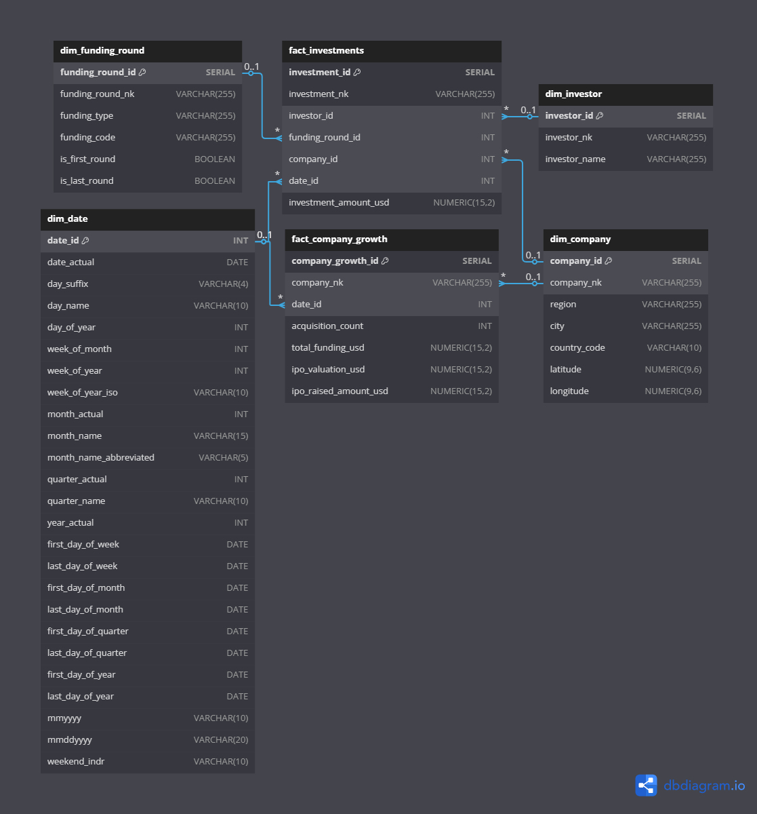

# Startup Investment Data Pipeline

The **Startup Investment Data Pipeline** aims to create a unified and scalable system to integrate startup ecosystem data collected from multiple sources: databases, semi-structured files, and APIs. This solution enables dynamic insights into market trends, company growth, investment patterns, and leadership profiles within startups.

---

## Table of Contents

* [Requirements Gathering & Proposed Solution](#requirements-gathering--proposed-solution)
* [Background Problem](#background-problem)
* [Proposed Solution](#proposed-solution)
* [Profiling Data](#profiling-data)
* [Pipeline Design](#pipeline-design)
* [Layers](#layers)
* [Logging System](#logging-system)
* [Validation System](#validation-system)
* [Design Target Database](#design-target-database)

  * [Dimensional Model and ERD](#dimensional-model-and-erd)
  * [Source to Target Mapping](#source-to-target-mapping)
* [ETL / ELT Pipeline Design](#etl--elt-pipeline-design)
* [Technology Stack](#technology-stack)
* [How the Pipeline Works & How to Run It](#how-the-pipeline-works--how-to-run-it)
* [Expected Output for Each Process](#expected-output-for-each-process)
* [License](#license)

---

## Requirements Gathering & Proposed Solution

The startup ecosystem generates massive and diverse datasets. However, these datasets are spread across:
- A **Startup Investment Database** (structured data)
- **Files** containing **people-related information** (semi-structured data)
- **Company milestone data** from an **external API** (dynamic real-time data)

Integrating these various formats into a centralized and queryable database is challenging due to differences in structure, format, and update frequency.

* **Data Sources**:

  * PostgreSQL database (structured data)
  * CSV files (realtionships, people, date dimension)
  * APIs (milestone tracking)

* **User Needs**:

  * Investors want to monitor startup funding, growth patterns, and executive roles.
  * Analysts need clean, queryable data to drive reports.

## Proposed Solution
* **Profiling DAG** to understand raw data
* **Designing Data Warehouse MOdel** dimensional model for Data Warehouse
* **ETL DAG** to extract, transform, and load to staging and warehouse
* **Validation and Logging** integrated into each step


## Profiling Data

A dedicated DAG named `data_profiling` performs profiling on each dataset. The results are stored in a PostgreSQL table with the following structure:

| Column        | Description                                      |
| ------------- | ------------------------------------------------ |
| sources       | Data source (Database, API, File)                |
| schema        | Schema name (or '-' if not applicable)           |
| n\_rows       | Number of rows                                   |
| n\_cols       | Number of columns                                |
| data\_profile | JSONB containing column profiling (nulls, types) |

---

## Pipeline Design

The pipeline consists of:

* Extract: Read from PostgreSQL, CSV, and APIs
* Transform: Normalize types, join, aggregate, and clean data
* Load: Save transformed data to a dimensional PostgreSQL data warehouse

---

## Layers

1. **Staging Layer**: Raw extracted data, type-casted minimally.
2. **Warehouse Layer**: Cleaned, transformed, and relational-ready data for analysis.


## Logging System

Logs are stored either in PostgreSQL or MinIO. These logs record:

* Step execution (start/end)
* Rows processed
* Errors or anomalies

---

<!-- ## Validation System

Data validation includes:

* Null checks on required columns
* Type validations (e.g., date, int, float)
* Foreign key integrity tests (optional) -->

---

## Design Target Database

### Dimensional Model and ERD



The dimensional model is designed to enable efficient querying and reporting by organizing data into facts and dimensions. The main components include:

- **Fact Tables**: `fact_company_growth`, `fact_investments`
- **Dimension Tables**: `dim_company`, `dim_investor`, `dim_funding_round`, `dim_date`

| **Fact Table / Dimension**  | **dim_company** | **dim_investor** | **dim_funding_round** | **dim_date** |
|-----------------------------|-----------------|------------------|-----------------------|--------------|
| **fact_company_growth**      | X               |                  |                       | X            |
| **fact_investments**         | X               | X                | X                     | X            |

| **Business Process**         | **Performance Metric**                                   |
|------------------------------|----------------------------------------------------------|
| **Company Growth**            | Acquisition count, total funding amount, IPO valuation, IPO raised amount |
| **Investment Transaction**    | Investment amount in USD                                 |

### Business Process: Company Growth

- **Declare Grain**:
  - Each record in the fact table will represent the company growth metrics (acquisitions, funding, IPO) at a specific date for a particular company.
  - This table will aggregate the growth information by company and date.

- **Identify the Dimensions**:
  - `dim_company`
  - `dim_date`

- **Identify the Facts**:
  - `fact_company_growth` (Transactional Fact Table Type)
  - Measures: `acquisition_count`, `total_funding_usd`, `ipo_valuation_usd`, `ipo_raised_amount_usd`

  ---

### Business Process: Investment Transactions

- **Declare Grain**:
  - Each record in the fact table will represent an investment event by an investor in a company during a funding round on a specific date.
  - This table aggregates investment data by investor, company, funding round, and date.

- **Identify the Dimensions**:
  - `dim_investor`
  - `dim_company`
  - `dim_funding_round`
  - `dim_date`

- **Identify the Facts**:
  - `fact_investments` (Transactional Fact Table Type)
  - Measures: `investment_amount_usd`

### Source to Target Mapping

A complete mapping table has been created ([source_to_target_mapping.md](https://github.com/hudiyaresa/airflow-investment-data-project/blob/main/source_to_target_mapping.md))
, outlining the source fields, target fields, and transformations required (casting, joining, aggregating).

---

## ETL / ELT Pipeline Design

Implemented in Python and PySpark (for large datasets) with modular scripts per table:

* `extract.py`
* `transform.py`
* `load.py`

Each script handles:

* Extract from source
* Transform with joins and type casting
* Load into warehouse

Airflow DAG triggers each module sequentially.

---

## Technology Stack

| Category         | Tools / Technologies         |
| ---------------- | ---------------------------- |
| Workflow Engine  | Apache Airflow               |
| Processing       | Python, Pandas, PySpark      |
| Storage          | PostgreSQL, MinIO (optional) |
| API Integration  | Python requests library      |
| Containerization | Docker, Docker Compose       |
| Logging          | PostgreSQL Table or Log File |

---

## How the Pipeline Works & How to Run It

### Step-by-Step Execution:

1. Clone repository

```bash
git clone https://github.com/hudiyaresa/airflow-investment-data-project.git
cd airflow-investment-data-project
```

2. Start environment

```bash
docker-compose up --build -d
```

3. Trigger Airflow DAGs via UI or CLI

```bash
airflow dags trigger investment_data_profiling
airflow dags trigger investment_data_pipeline
```

### Running Spark manually (optional)

```bash
docker exec -it pyspark_project_container /bin/bash
spark-submit your_etl_script.py
```

---

## Expected Output for Each Process

| Process             | Output                                               |
| ------------------- | ---------------------------------------------------- |
| Data Profiling      | `profiling_table` populated with schema and stats    |
| Data Extraction     | Staging DB populated with raw data                   |
| Data Transformation | Cleaned and joined DataFrames ready for loading      |
| Data Load           | Data inserted into warehouse fact & dimension tables |

---

## License

This project is licensed under the **Apache License 2.0**. Contributions are welcome via pull requests.
